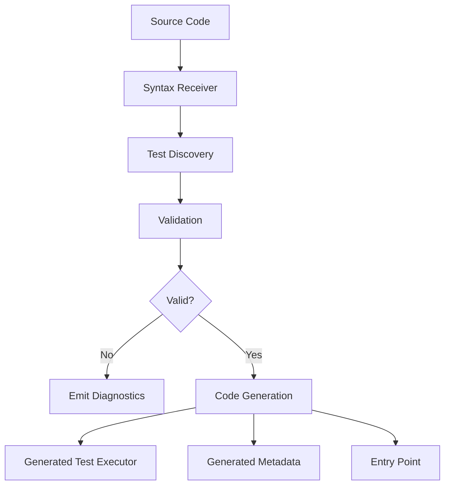

# UXUnit.Generators Design

## Overview

UXUnit.Generators is a Roslyn source generator that analyzes test code at compile time and generates optimized test execution code. This eliminates runtime reflection, enables compile-time validation, and produces highly optimized test runners.

## Design Principles

1. **Compile-Time Everything**: Discover, validate, and generate code at build time
2. **Zero Reflection**: Generated code uses direct method invocation
3. **Early Error Detection**: Catch test configuration errors during compilation
4. **Optimal Code Generation**: Produce the most efficient execution path possible
5. **Incremental Generation**: Support incremental compilation for fast rebuilds

## Architecture



## Core Components

### 1. Incremental Syntax Receiver

Efficiently discovers test classes during compilation:

```csharp
class TestClassSyntaxReceiver : ISyntaxReceiver
{
    public List<ClassDeclarationSyntax> TestClasses { get; } = new();

    public void OnVisitSyntaxNode(SyntaxNode syntaxNode)
    {
        // Find classes with [TestClass], [Fact], [Theory] attributes
        if (syntaxNode is ClassDeclarationSyntax classDecl)
        {
            if (HasTestAttributes(classDecl))
            {
                TestClasses.Add(classDecl);
            }
        }
    }
}
```

### 2. Test Discovery

Analyzes discovered classes to extract test metadata:

```csharp
class TestDiscoveryAnalyzer
{
    public TestClassModel AnalyzeTestClass(
        ClassDeclarationSyntax classSyntax,
        SemanticModel semanticModel)
    {
        // Extract:
        // - Class name, namespace, accessibility
        // - Test methods with attributes
        // - Setup/cleanup methods
        // - Test data sources
        // - Lifecycle hooks
    }
}
```

### 3. Validation

Validates test structure and emits diagnostics for errors:

```csharp
class TestValidator
{
    public IEnumerable<Diagnostic> Validate(TestClassModel testClass)
    {
        // Validate:
        // - Test methods are public
        // - Test methods have valid signatures
        // - Setup/cleanup methods have correct signature
        // - No duplicate test names
        // - Parameterized tests have data sources
        // - Timeout values are positive
    }
}
```

**Diagnostic Examples**:
- `UX0001`: Test method must be public
- `UX0002`: Test method cannot have ref/out parameters
- `UX0003`: Theory method must have test data
- `UX0004`: Timeout must be positive
- `UX0005`: Setup method must return void or Task

### 4. Code Generation

Generates three types of code for each test assembly:

#### A. Test Executor (per test class)

Direct method invocations for each test:

```csharp
// Generated: CalculatorTests.g.cs
internal static class CalculatorTests_Executor
{
    public static readonly TestClassMetadata Metadata = new()
    {
        ClassName = "CalculatorTests",
        DisplayName = null,
        TestMethods = new[]
        {
            new TestMethodMetadata
            {
                MethodName = "Add_TwoNumbers_ReturnsSum",
                IsAsync = false,
                TimeoutMs = 5000,
                // ...
            }
        }
    };

    public static async Task<TestResult> Execute_Add_TwoNumbers_ReturnsSum(
        CancellationToken cancellationToken)
    {
        var testId = "CalculatorTests.Add_TwoNumbers_ReturnsSum";
        var startTime = DateTime.UtcNow;
        var stopwatch = Stopwatch.StartNew();

        var instance = new CalculatorTests();
        try
        {
            // Call setup if exists
            instance.Setup();

            // Execute test method (direct call, no reflection!)
            instance.Add_TwoNumbers_ReturnsSum();

            // Call cleanup if exists
            instance.Cleanup();

            stopwatch.Stop();
            return TestResult.Success(
                testId,
                "Add_TwoNumbers_ReturnsSum",
                stopwatch.Elapsed,
                startTime,
                DateTime.UtcNow);
        }
        catch (Exception ex)
        {
            stopwatch.Stop();
            return TestResult.Failure(
                testId,
                "Add_TwoNumbers_ReturnsSum",
                ex,
                stopwatch.Elapsed,
                startTime,
                DateTime.UtcNow);
        }
        finally
        {
            if (instance is IDisposable disposable)
                disposable.Dispose();
        }
    }
}
```

#### B. Test Registry (per assembly)

Aggregates all test metadata and executors:

```csharp
// Generated: TestRegistry.g.cs
internal static class GeneratedTestRegistry
{
    public static readonly TestClassMetadata[] AllTestClasses = new[]
    {
        CalculatorTests_Executor.Metadata,
        StringHelperTests_Executor.Metadata,
        // ... all other test classes
    };

    public static async Task<TestResult> ExecuteTestAsync(
        string testId,
        CancellationToken cancellationToken)
    {
        return testId switch
        {
            "CalculatorTests.Add_TwoNumbers_ReturnsSum" =>
                await CalculatorTests_Executor.Execute_Add_TwoNumbers_ReturnsSum(cancellationToken),
            "StringHelperTests.Reverse_SimpleString_ReturnsReversed" =>
                await StringHelperTests_Executor.Execute_Reverse_SimpleString_ReturnsReversed(cancellationToken),
            // ... all other tests
            _ => throw new InvalidOperationException($"Unknown test: {testId}")
        };
    }
}
```

#### C. Program Entry Point

For test executables:

```csharp
// Generated: Program.g.cs (only if assembly is executable)
class Program
{
    static async Task<int> Main(string[] args)
    {
        var results = await TestExecutionEngine.ExecuteTestsAsync(
            GeneratedTestRegistry.AllTestClasses,
            new TestExecutionOptions
            {
                // Parse from args
            });

        var reporter = new ConsoleTestReporter();
        reporter.Report(results);

        return results.HasFailures ? 1 : 0;
    }
}
```

## Code Generation Patterns

### Async/Await Handling

Generator detects async methods and generates appropriate code:

```csharp
// For async test methods
if (method.IsAsync)
{
    builder.AppendLine("await instance.AsyncTestMethod();");
}
else
{
    builder.AppendLine("instance.SyncTestMethod();");
}
```

### Parameterized Test Handling

For methods with `[Theory]` and `[InlineData]`:

```csharp
// Generated for [Theory] with multiple [InlineData]
public static async Task<TestResult[]> Execute_AdditionTest(
    CancellationToken cancellationToken)
{
    var results = new List<TestResult>();

    // Test case 1: [InlineData(1, 2, 3)]
    results.Add(await Execute_AdditionTest_Case0(1, 2, 3, cancellationToken));

    // Test case 2: [InlineData(5, 10, 15)]
    results.Add(await Execute_AdditionTest_Case1(5, 10, 15, cancellationToken));

    return results.ToArray();
}

private static async Task<TestResult> Execute_AdditionTest_Case0(
    int a, int b, int expected, CancellationToken cancellationToken)
{
    var instance = new MathTests();
    try
    {
        instance.AdditionTest(a, b, expected);
        return TestResult.Success(...);
    }
    catch (Exception ex)
    {
        return TestResult.Failure(...);
    }
}
```

### Timeout Handling

For methods with timeout specification:

```csharp
var cts = CancellationTokenSource.CreateLinkedTokenSource(cancellationToken);
cts.CancelAfter(TimeSpan.FromMilliseconds(5000));

try
{
    await ExecuteTestWithTimeoutAsync(instance, cts.Token);
}
catch (OperationCanceledException) when (cts.IsCancellationRequested)
{
    return TestResult.Failure(testId, methodName,
        new TimeoutException($"Test exceeded timeout of 5000ms"));
}
```

## Optimization Strategies

### 1. Dead Code Elimination

Only generate code for features actually used:
- Skip setup/cleanup generation if not present
- Skip timeout handling if no timeout specified
- Skip IDisposable handling if class doesn't implement it

### 2. String Interning

Use string constants for repeated identifiers:

```csharp
private const string ClassName = "CalculatorTests";
private const string TestMethod1 = "Add_TwoNumbers_ReturnsSum";
```

### 3. Metadata Caching

Generate metadata once as static readonly fields:

```csharp
public static readonly TestClassMetadata Metadata = /* ... */;
```

## Incremental Generation

Support fast incremental builds:

```csharp
[Generator]
public class UXUnitSourceGenerator : IIncrementalGenerator
{
    public void Initialize(IncrementalGeneratorInitializationContext context)
    {
        // Only regenerate when test classes change
        var testClasses = context.SyntaxProvider
            .CreateSyntaxProvider(
                predicate: IsTestClass,
                transform: ExtractTestClass)
            .Where(static m => m is not null);

        context.RegisterSourceOutput(testClasses, GenerateTestExecutor);
    }
}
```

## Diagnostics

### Error Categories

1. **UX0xxx**: Test structure errors (must fix)
2. **UX1xxx**: Warnings (should fix)
3. **UX2xxx**: Informational (optimization hints)

### Examples

```csharp
// UX0001: Error - test method not public
public static readonly DiagnosticDescriptor TestMethodMustBePublic = new(
    id: "UX0001",
    title: "Test method must be public",
    messageFormat: "Test method '{0}' must be public",
    category: "UXUnit.Usage",
    defaultSeverity: DiagnosticSeverity.Error,
    isEnabledByDefault: true);

// UX1001: Warning - async void test
public static readonly DiagnosticDescriptor AvoidAsyncVoid = new(
    id: "UX1001",
    title: "Avoid async void test methods",
    messageFormat: "Test method '{0}' should return Task instead of async void",
    category: "UXUnit.Usage",
    defaultSeverity: DiagnosticSeverity.Warning,
    isEnabledByDefault: true);
```

## Testing the Generator

The generator itself has comprehensive tests:

```csharp
[Fact]
public void GeneratesCorrectCode_ForSimpleTest()
{
    var source = @"
        [TestClass]
        public class MyTests
        {
            [Fact]
            public void SimpleTest() { }
        }";

    var generated = RunGenerator(source);

    Assert.Contains("Execute_SimpleTest", generated);
    Assert.Contains("new MyTests()", generated);
    Assert.Contains("instance.SimpleTest()", generated);
}
```

## Future Enhancements

- **Code Coverage Integration**: Generate coverage metadata
- **Performance Hints**: Suggest optimizations based on test patterns
- **Custom Generators**: Allow user-defined code generation extensions
- **Smart Test Ordering**: Generate optimal execution order based on dependencies
