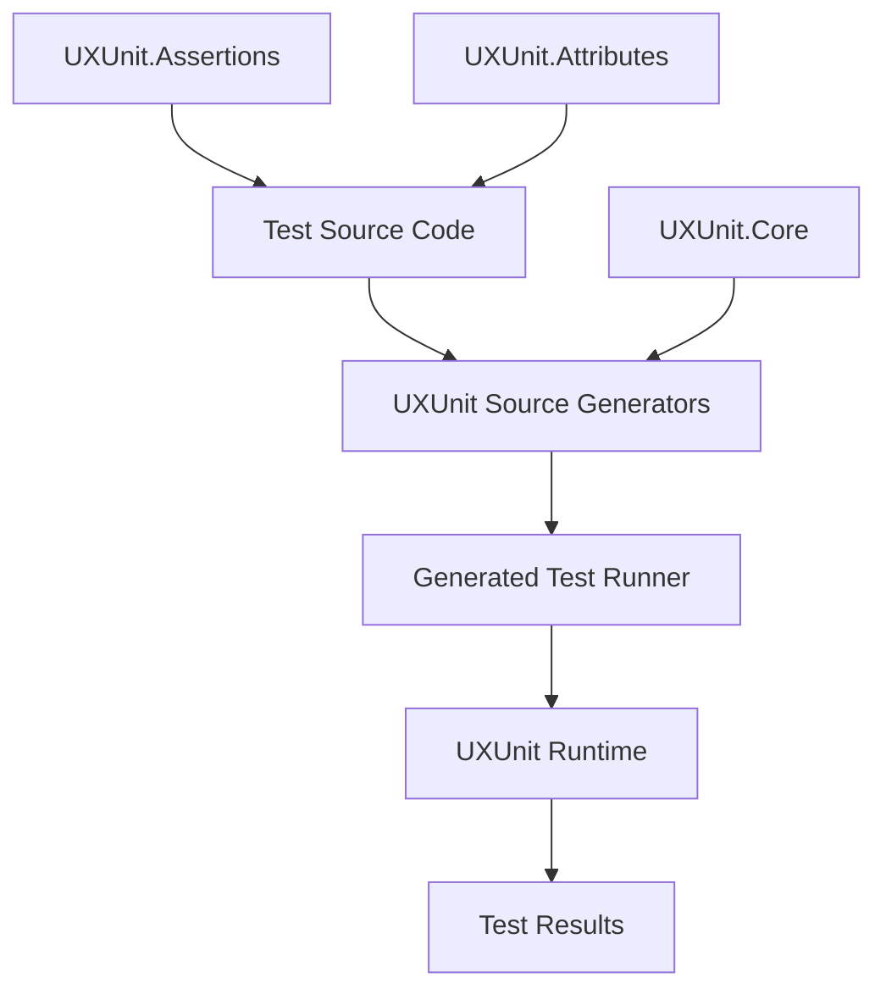
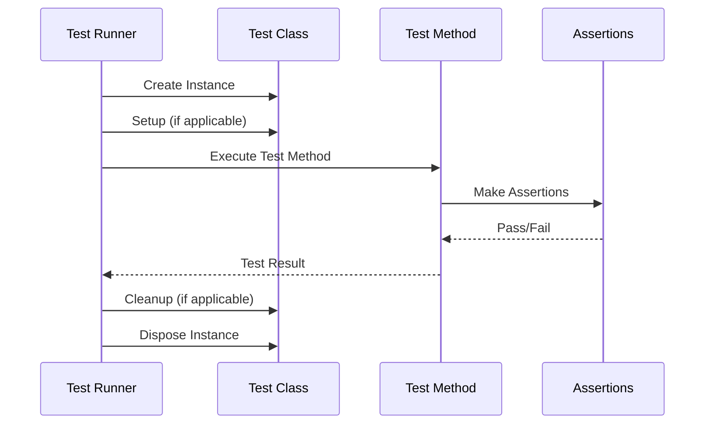

# UXUnit Design Document

## Vision

UXUnit is a next-generation unit testing framework for .NET that leverages source generators to provide compile-time test discovery, validation, and code generation. The framework aims to deliver superior performance, better developer experience, and enhanced reliability compared to traditional reflection-based testing frameworks.

## Design Goals

### Primary Goals
- **Performance**: Eliminate runtime reflection overhead through compile-time code generation
- **Developer Experience**: Provide rich tooling support, clear error messages, and intuitive APIs
- **Reliability**: Catch test configuration errors at compile time rather than runtime
- **Simplicity**: Minimize boilerplate code and configuration complexity
- **Extensibility**: Support custom attributes, assertions, and test behaviors

### Non-Goals
- Backward compatibility with existing xUnit syntax (clean slate approach)
- Support for dynamic test discovery at runtime
- Integration with legacy test runners (focus on modern tooling)

## Architecture Overview

### High-Level Components



### Component Responsibilities

#### UXUnit.Core
- Defines core interfaces and base types
- Provides attribute definitions for test marking
- Contains shared utilities and helpers

#### UXUnit.Generators
- Analyzes source code for test classes and methods
- Generates test runner code at compile time
- Validates test method signatures and attributes
- Creates optimized test execution paths

#### UXUnit.Runtime
- Executes generated test runners
- Manages test lifecycle and state
- Handles parallel execution and synchronization
- Collects and reports test results

#### UXUnit.Assertions
- Provides fluent assertion API
- Generates detailed failure messages
- Supports custom assertion extensions

## Source Generation Strategy

### Test Discovery Process

1. **Compilation Phase**: Source generators scan all source files
2. **Analysis Phase**: Identify classes marked with `[TestClass]`
3. **Validation Phase**: Validate test method signatures and attributes
4. **Generation Phase**: Generate optimized test runner code

### Generated Code Structure

For each test class, the generator creates:

```csharp
// Generated for CalculatorTests
internal sealed class CalculatorTestsRunner : ITestClassRunner
{
    public TestClassMetadata Metadata { get; } = new TestClassMetadata
    {
        Name = "CalculatorTests",
        TestMethods = new[]
        {
            new TestMethodMetadata("Add_TwoNumbers_ReturnsSum", ...),
            // ... other methods
        }
    };

    public async Task<TestResult[]> RunAllTestsAsync(TestContext context)
    {
        var instance = new CalculatorTests();
        var results = new List<TestResult>();

        // Generated method calls (no reflection)
        results.Add(await RunTest_Add_TwoNumbers_ReturnsSum(instance, context));
        // ... other test method calls

        return results.ToArray();
    }

    private async Task<TestResult> RunTest_Add_TwoNumbers_ReturnsSum(
        CalculatorTests instance, TestContext context)
    {
        try
        {
            instance.Add_TwoNumbers_ReturnsSum(); // Direct method call
            return TestResult.Success("Add_TwoNumbers_ReturnsSum");
        }
        catch (Exception ex)
        {
            return TestResult.Failure("Add_TwoNumbers_ReturnsSum", ex);
        }
    }
}
```

## Test Lifecycle

### Execution Flow

1. **Discovery**: Compile-time generation creates test registry
2. **Initialization**: Test runner loads generated test classes
3. **Execution**: Direct method invocation (no reflection)
4. **Cleanup**: Deterministic cleanup and resource disposal
5. **Reporting**: Structured result collection and output

### Test Method Lifecycle



## Attribute System

For seamless migration from XUnit, UXUnit provides compatible attributes:

- `[Fact]`: Maps to `[Test]` - marks individual test methods
- `[Theory]`: Maps to `[Test]` - marks parameterized test methods
- `[InlineData(...)]`: Maps to `[TestData(...)]` - provides test parameters

These allow existing XUnit tests to run with minimal changes:

```csharp
// XUnit syntax that works with UXUnit
[Fact]
public void SimpleTest()
{
    Assert.Equal(42, Calculate());
}

[Theory]
[InlineData(1, 2, 3)]
[InlineData(5, 10, 15)]
public void AdditionTest(int a, int b, int expected)
{
    Assert.Equal(expected, a + b);
}
```
- `[TestData(...)]`: Provides parameterized test data
- `[Setup]`: Method to run before each test
- `[Cleanup]`: Method to run after each test
- `[ClassSetup]`: Method to run once before all tests in class
- `[ClassCleanup]`: Method to run once after all tests in class

### Custom Attributes

Framework supports custom attributes through interfaces:

```csharp
public interface ITestMethodAttribute
{
    void OnBeforeTest(TestContext context);
    void OnAfterTest(TestContext context, TestResult result);
}

public interface ITestClassAttribute
{
    void OnBeforeClass(TestContext context);
    void OnAfterClass(TestContext context, TestResult[] results);
}
```

## Performance Characteristics

### Compile-Time Benefits
- Early error detection for malformed tests
- Optimized code generation based on actual test structure
- Elimination of runtime type scanning and reflection

### Runtime Benefits
- Direct method invocation (no reflection overhead)
- Optimized test execution paths
- Minimal allocations during test execution
- Built-in parallel execution support

### Memory Efficiency
- No runtime metadata caching
- Deterministic object lifecycle management
- Minimal framework overhead per test

## Error Handling and Diagnostics

### Compile-Time Diagnostics
- Invalid test method signatures
- Missing or incorrect attribute usage
- Circular dependencies in test setup
- Performance warnings for sub-optimal patterns

### Runtime Error Handling
- Structured exception capturing
- Rich assertion failure messages
- Test timeout handling
- Resource leak detection

## Extensibility Points

### Custom Assertions
```csharp
public static class CustomAssertions
{
    public static void IsValidEmail(this Assert assert, string email)
    {
        // Custom assertion implementation
    }
}
```

### Custom Test Data Sources
```csharp
[AttributeUsage(AttributeTargets.Method, AllowMultiple = true)]
public class DatabaseTestDataAttribute : Attribute, ITestDataSource
{
    public IEnumerable<object[]> GetTestData(MethodInfo method)
    {
        // Load test data from database
    }
}
```

### Test Result Processors
```csharp
public interface ITestResultProcessor
{
    Task ProcessResultAsync(TestResult result);
}
```

## Integration Points

### Build Integration
- MSBuild targets for test discovery
- Integration with .NET CLI test commands
- Support for CI/CD pipelines

### IDE Integration
- Test Explorer support through generated metadata
- Debugger integration for test execution
- IntelliSense support for generated code

### Tooling Integration
- Coverage analysis support
- Performance profiling integration
- Test result reporting formats (JUnit, TRX, etc.)

## Migration Strategy

### From XUnit
- XUnit compatibility attributes (`[Fact]`, `[Theory]`, `[InlineData]`) work directly
- Side-by-side execution during migration
- Clear migration documentation and examples

### Incremental Adoption
- Assembly-level opt-in for gradual adoption
- Compatibility layer for existing test infrastructure
- Migration validation tools

## Future Considerations

### Planned Features
- Snapshot testing support
- Property-based testing integration
- Advanced parallel execution strategies
- Cloud-native test execution

### Research Areas
- Integration with formal verification tools
- AI-assisted test generation
- Advanced mutation testing support
- Performance regression detection