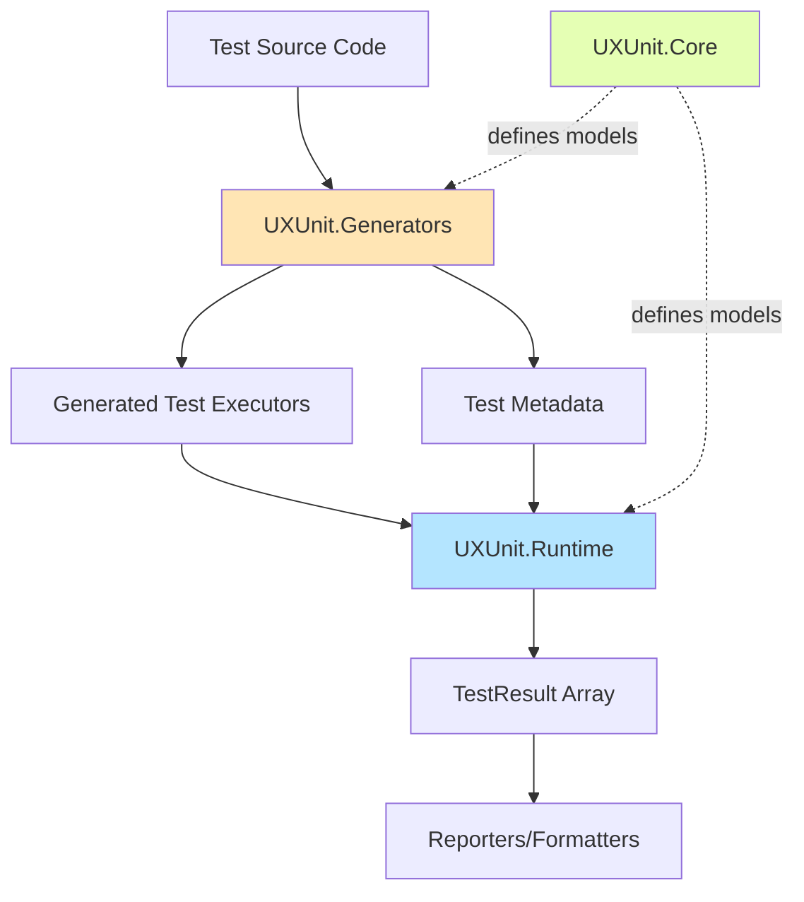

# UXUnit Design Overview

## Vision

UXUnit is a next-generation unit testing framework for .NET that leverages source generators to provide compile-time test discovery, validation, and code generation. The framework aims to deliver superior performance, better developer experience, and enhanced reliability compared to traditional reflection-based testing frameworks.

## Design Goals

### Primary Goals
- **Performance**: Eliminate runtime reflection overhead through compile-time code generation
- **Developer Experience**: Provide rich tooling support, clear error messages, and intuitive APIs
- **Reliability**: Catch test configuration errors at compile time rather than runtime
- **Simplicity**: Minimize boilerplate code and configuration complexity
- **Clean Architecture**: No unnecessary abstraction layers

### Non-Goals
- Backward compatibility with existing xUnit syntax (though migration path provided)
- Support for dynamic test discovery at runtime
- Extensible test runner framework (we ARE the framework)

## Architecture Overview

### High-Level Flow



### Component Packages

#### [UXUnit.Core](./design-core.md)
**Purpose**: Pure data models and contracts
**No runtime logic** - only data structures

- Data models (TestResult, TestClassMetadata, etc.)
- Attributes ([Test], [Fact], [Theory], etc.)
- Interfaces (ITestContext, ITestOutput, etc.)

See [Core Design Document](./design-core.md) for details.

#### [UXUnit.Generators](./design-generator.md)
**Purpose**: Compile-time code generation
**Roslyn source generator**

- Discovers test classes and methods
- Validates test structure at compile time
- Generates optimized test execution code
- Generates metadata for test discovery

See [Generator Design Document](./design-generator.md) for details.

#### [UXUnit.Runtime](./design-runtime.md)
**Purpose**: Test execution engine
**Pure function: metadata → results**

- Executes generated test delegates
- Coordinates parallel/sequential execution
- Returns structured test results
- **No presentation logic**

See [Runtime Design Document](./design-runtime.md) for details.

#### UXUnit.Assertions
**Purpose**: Assertion library
**Fluent API for test assertions**

- Equality, comparison, collection assertions
- Exception assertions
- Custom assertion extensibility

## Key Design Principles

### 1. No Unnecessary Abstractions

UXUnit is **the framework**, not a framework for building test runners:

- ❌ No `ITestRunner` interface - execution engine is a static function
- ❌ No `ITestClassRunner` - generated code creates delegates directly
- ❌ No `TestClassRunnerBase` - source generation eliminates need for inheritance
- ✅ Simple data flow: `Metadata → Execute → Results`

### 2. Separation of Concerns

**Execution** is separate from **presentation**:

```csharp
// Execution: Pure function
TestResult[] results = await TestExecutionEngine.ExecuteTestsAsync(metadata);

// Presentation: Separate layer
ITestResultReporter reporter = new ConsoleReporter();
reporter.Report(results);
```

### 3. Zero Reflection

All test invocations happen through generated code:

```csharp
// Generated - direct method call, no reflection!
instance.MyTestMethod();

// NOT this:
// method.Invoke(instance, null);  ❌
```

## End-to-End Flow

### Example: Simple Test

**User writes**:
```csharp
[TestClass]
public class CalculatorTests
{
    [Fact]
    public void Add_ReturnsSum()
    {
        var calc = new Calculator();
        Assert.Equal(5, calc.Add(2, 3));
    }
}
```

**Generator creates** (compile time):
```csharp
internal static class CalculatorTests_Executor
{
    public static async Task<TestResult> Execute_Add_ReturnsSum(
        CancellationToken ct)
    {
        var instance = new CalculatorTests();
        try
        {
            instance.Add_ReturnsSum();  // Direct call!
            return TestResult.Success(...);
        }
        catch (Exception ex)
        {
            return TestResult.Failure(..., ex);
        }
    }
}
```

**Runtime executes** (runtime):
```csharp
var results = await TestExecutionEngine.ExecuteTestsAsync(
    new[] { CalculatorTests_Executor.Metadata },
    options);
// results[0].Status == TestStatus.Passed
```

## Performance Characteristics

- **Zero Reflection**: Direct method calls via source generation
- **Minimal Allocations**: Efficient result collection
- **Parallel Execution**: Built-in support with configurable parallelism
- **Compile-Time Validation**: Catch errors before running tests

## XUnit Migration Path

UXUnit provides compatibility attributes for easy migration:

```csharp
// These work out of the box:
[Fact]              // → maps to [Test]
[Theory]            // → maps to [Test] with parameters
[InlineData(...)]   // → provides test case data
```

See [specification.md](./specification.md) for complete attribute reference.

## Documentation

- **[design-core.md](./design-core.md)** - UXUnit.Core data models and contracts
- **[design-generator.md](./design-generator.md)** - Source generator implementation
- **[design-runtime.md](./design-runtime.md)** - Test execution engine
- **[specification.md](./specification.md)** - Complete API specification
- **[data-model.md](./data-model.md)** - Data model reference
- **[getting-started.md](./getting-started.md)** - Quick start guide